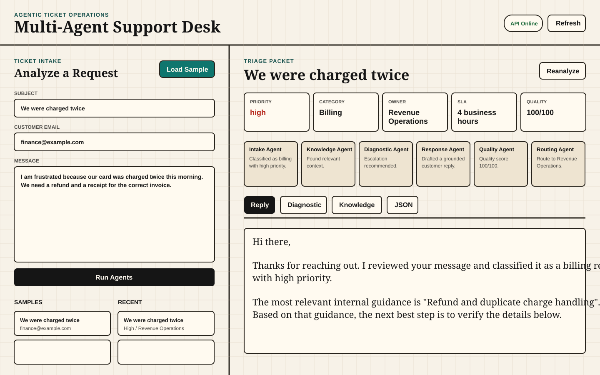
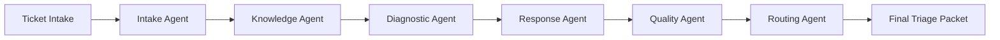

# Multi-Agent Support Desk

An open-source, practical multi-agent system for triaging customer support
tickets, finding relevant knowledge base context, drafting replies, checking
quality, and routing work to the right team.

The first version is intentionally dependency-light: it runs with the Python
standard library, SQLite, and a static web dashboard. It is useful without an
LLM key, while leaving clean extension points for OpenAI-compatible providers.



## What It Does

- Classifies support tickets by category, sentiment, severity, and urgency.
- Searches a local knowledge base for grounded context.
- Identifies missing details and escalation risks.
- Drafts a customer-facing reply.
- Reviews the draft for tone, completeness, and hallucination risk.
- Routes the ticket to an owner team with tags and SLA guidance.
- Stores tickets and agent traces in SQLite for demos and audits.
- Imports Slack messages, Slack slash commands, and GitHub Issues as tickets.
- Tracks human approval state before a drafted reply is send-ready.
- Shows queue analytics by priority, owner team, SLA, action, and approval state.

## Agent Pipeline



## Quick Start

```bash
python3 -m supportdesk.server
```

Then open:

```text
http://127.0.0.1:8080
```

Run tests:

```bash
python3 -m unittest discover -s tests
```

## Docker

```bash
docker compose up --build
```

## API

```text
GET  /api/health
GET  /api/sample-tickets
GET  /api/knowledge
GET  /api/analytics
GET  /api/tickets
GET  /api/tickets/{id}
POST /api/tickets/analyze
POST /api/tickets/{id}/reanalyze
POST /api/tickets/{id}/approval
POST /api/integrations/slack
POST /api/integrations/github-issues
```

Example request:

```bash
curl -sS -X POST http://127.0.0.1:8080/api/tickets/analyze \
  -H "Content-Type: application/json" \
  -d '{"subject":"Cannot login","message":"Password reset is not working and our team is blocked."}'
```

Approval update:

```bash
curl -sS -X POST http://127.0.0.1:8080/api/tickets/TICKET_ID/approval \
  -H "Content-Type: application/json" \
  -d '{"status":"approved","reviewer":"lead@example.com","note":"Ready to send."}'
```

Supported approval statuses are `pending`, `approved`, `changes_requested`,
and `escalated`.

## Intake Adapters

Slack message events and Slack slash command payloads can be sent to:

```text
POST /api/integrations/slack
```

GitHub issue webhook payloads can be sent to:

```text
POST /api/integrations/github-issues
```

The adapters normalize external payloads into the same `Ticket` model used by
the dashboard, preserving provider metadata in the stored triage packet.

## Markdown Knowledge Base

The default knowledge base is JSON. To load a directory of Markdown articles,
point `SUPPORT_DESK_KNOWLEDGE_PATH` at a folder:

```bash
export SUPPORT_DESK_KNOWLEDGE_PATH=./knowledge
python3 -m supportdesk.server
```

Markdown files may include simple front matter:

```markdown
---
title: Refund Playbook
category: billing
team: Revenue Operations
keywords: [refund, duplicate charge, invoice]
---

# Refund Playbook

Confirm invoice evidence before promising a refund.
```

## Optional LLM Drafting

The default response agent is deterministic. To test an OpenAI-compatible
provider for final draft generation:

```bash
cp .env.example .env
export SUPPORT_DESK_USE_LLM=true
export OPENAI_API_KEY=...
python3 -m supportdesk.server
```

If the provider call fails, the system falls back to the deterministic draft and
records the error in the response agent output.

## Project Structure

```text
supportdesk/     Agent pipeline, API server, SQLite storage
frontend/        Static dashboard served by the Python app
data/            Sample tickets and knowledge base articles
tests/           Standard-library unittest coverage
scripts/         Local development helpers
```

## Repository Goals

This project is built to be easy to understand, demo, fork, and extend:

- no required paid API key for the baseline demo
- readable agent boundaries
- testable business logic
- useful sample data
- clear open-source contribution path

## Roadmap

- Gmail, Zendesk, and Discord adapters
- PDF knowledge base loading
- Hosted demo deployment template
